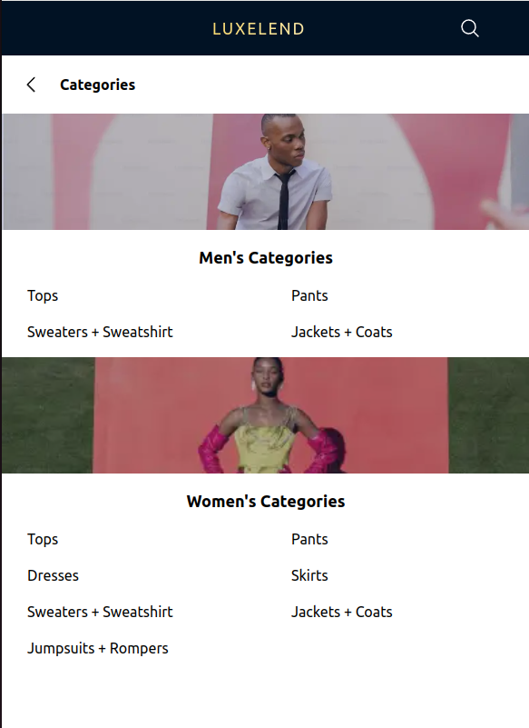

## LUXELEND

“Luxeland: Elevating Your Style, Redefining Luxury Rentals."

Urban’s premier luxury fashion rental platform

## Table of Contents

1. [LUXELEND](#luxelend)
2. [Problem Statement](#problem-statement)
3. [Solution](#solution)
4. [Deployment](#deployment)
5. [Tech Stack](#tech-stack)
   - [Languages](#languages)
   - [Libraries and Dependencies](#libraries-and-dependencies)
6. [Pages](#pages)
   - [Homepage](#homepage-)
   - [Category Page](#category-page-)
   - [Results Page](#results-page-based-on-gender-and-categories)
   - [Product Detail Page](#product-detail-page--product_id-)
7. [Feature](#feature)
   - [Filtering Option](#filtering-option)
   - [Sorting Functionality](#sorting-functionality)
   - [WhatsApp Integration for Rental](#whatsapp-integration-for-rental)
8. [Prerequisites](#prerequisites)
9. [Run in Local](#run-in-local)
   - [Clone or Pulling from Repo](#clone-or-pulling-from-repo)
   - [Optional Checkout](#optional)
   - [Install Dependency](#instal-dependency)
   - [Run](#run)
   - [Test Build/Deployment](#test-builddeployment)
10. [React + Vite](#react--vite)

## Problem Statement

- Overwhelming selection process due to unorganized product catalog
- The mismatch of the picture and the actual clothes in real life making users hesitate to rent the clothes

## Solution

- Development of rental platform where users can select products based on categories and real pictures

## Deployment

- Link :
- Platform :

## Tech stack

### Languages

- Javascript
- HTML
- CSS

### Libraries and dependencies

- React
- Vite
- Yarn
- React-router-dom
- Axios
- Tailwind CSS

## Pages

- Homepage = "/"
  
  **Usage**: Explore featured items and navigate through different sections of the platform such as banner, product links and search feature (to be implement)

- Category Page = "/category"
  
  **Usage**: Browse items based on specific categories divided based on the gender and user can choose what kind of categories they looking for.

- Results page (Based on gender and categories)

  - "/:gender" , example : "/men" or "/women"
  - "/:category/:gender", example : "tops/women"
    
  **Usage**: After choosing which gender are they, user can manually filter spesific things for instance: Filter base on size, color and etc. (Read feature section)

- Product detail page : "/productDetail/:product_id" , example : "productDetail/35"
  

## Feature

### Filtering Option
  -. Gender: Filter products based on gender (e.g., Men, Women).
  -. Color: Select products based on available colors.
  -. Size: Filter by available sizes to find the perfect fit.
  -. Material: Choose products based on the material they are made of.
  -. Brand: Filter by brand to find items from preferred designers.
  -. Availability: Check product availability to ensure items are in stock.
  
### Sorting Functionality
  -. Newest: Sort products by the newest arrivals to stay updated with the latest trends.
  -. Price: Sort products by price (e.g., low to high, high to low).
  
### WhatsApp integration for rental
  -. Rent through WhatsApp: Use the **click-to-chat** API to rent products directly through WhatsApp for a seamless rental experience.
  
## Prerequisities

### **Node.js and npm/yarn installed on your machine **
## Note: It is crucial to have Node.js and npm/yarn installed on your machine to run the project locally. If you don't have them installed, please follow the instructions below:
    -.Install Node.js
    -.Install Yarn (recommended) or use npm

## Run in local

### Clone or pulling from repo

git pull/clone https://github.com/Adsyarif/luxelend-client-side.git

### Optional

Checkout to determine branch
-. git checkout "nama branch"

### Instal Dependency

yarn install

### Run

yarn dev

### Test build/deployment

yarn build  
yarn preview

# React + Vite

This template provides a minimal setup to get React working in Vite with HMR and some ESLint rules.

Currently, two official plugins are available:

- [@vitejs/plugin-react](https://github.com/vitejs/vite-plugin-react/blob/main/packages/plugin-react/README.md) uses [Babel](https://babeljs.io/) for Fast Refresh
- [@vitejs/plugin-react-swc](https://github.com/vitejs/vite-plugin-react-swc) uses [SWC](https://swc.rs/) for Fast Refresh
