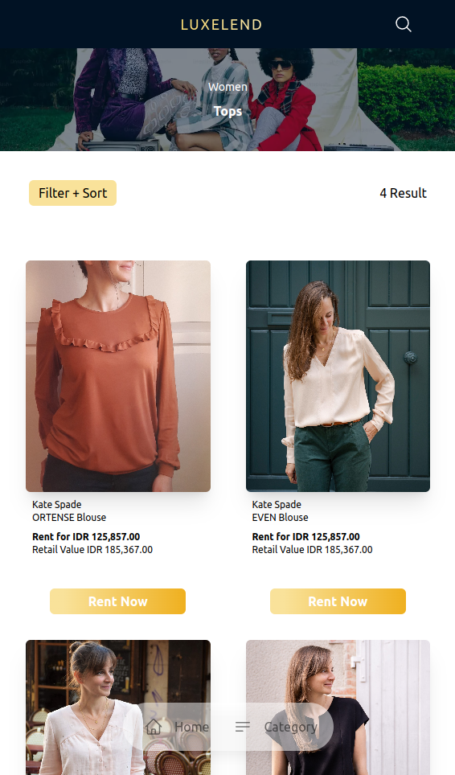
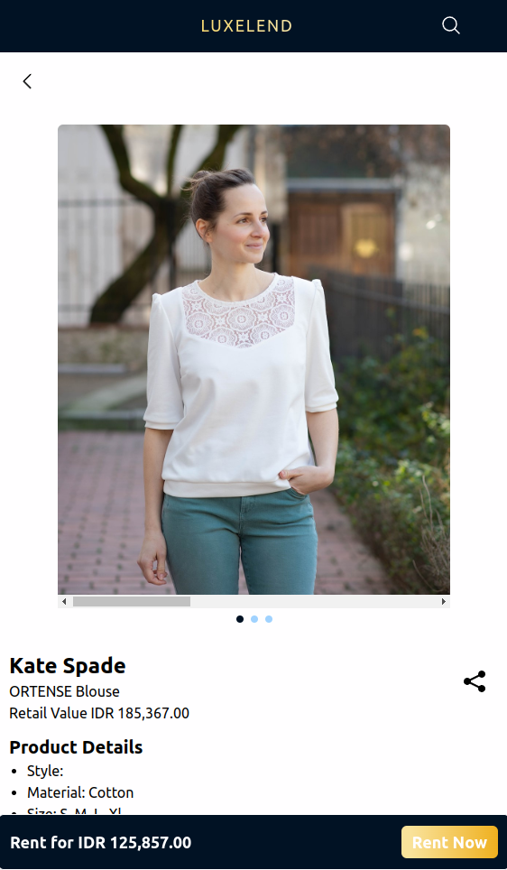

## LUXELEND

“Luxeland: Elevating Your Style, Redefining Luxury Rentals."

Luxelend primarily focuses on collections from renowned brands and famous designers, ensuring users easily access high-end fashion choices.

With available gender categories (men or women), users can easily tailor their search to their fashion needs. Through Luxelend access to high-end clothing no longer requires a trip to physical stores, as all these exclusive products can be quickly found and obtained through this mobile application.

Urban’s premier luxury fashion rental platform

## Table of Contents

1. [LUXELEND](#luxelend)
2. [Problem Statement](#problem-statement)
3. [Solution](#solution)
4. [Deployment](#deployment)
5. [Tech Stack](#tech-stack)
   - [Languages](#languages)
   - [Libraries and Dependencies](#libraries-and-dependencies)
   - [Database](#database)
   - [Design Tools](#design-tools)
6. [User FLow](#user-flow)
7. [Pages](#pages)
   - [Homepage](#homepage-)
   - [Category Page](#category-page-)
   - [Results Page](#results-page-based-on-gender-and-categories)
   - [Product Detail Page](#product-detail-page--product_id-)
8. [Feature](#feature)
   - [Filtering Option](#filtering-option)
   - [Sorting Functionality](#sorting-functionality)
   - [WhatsApp Integration for Rental](#whatsapp-integration-for-rental)
9. [Prerequisites](#prerequisites)
10. [Run in Local](#run-in-local)
   - [Clone or Pulling from Repo](#clone-or-pulling-from-repo)
   - [Optional Checkout](#optional)
   - [Install Dependency](#instal-dependency)
   - [Run](#run)
   - [Test Build/Deployment](#test-builddeployment)
11. [Folder Structure](#folder-structure)
12. [Future Development Features](#future-development-features)
13. [Team Developer]()


## Problem Statement

- Overwhelming selection process due to unorganized product catalog
- The mismatch of the picture and the actual clothes in real life making users hesitate to rent the clothes

## Solution

- Development of rental platform where users can select products based on categories and real pictures

## Deployment

- Backend Repository : https://github.com/desyasarbini/Luxelend-server
- Platform : https://luxelend-client-side.vercel.app/

## Tech stack

### Languages

- Javascript
- HTML
- CSS

### Libraries and dependencies

- React
- Vite
- Yarn
- React-router-dom
- Axios
- Tailwind CSS

### Database

- Supabase (PostgreSQL)

### Design Tools 

- Figma

## User Flow


## Pages

- Homepage = "/"

  

  **Usage**: Explore featured items and navigate through different sections of the platform such as banner, product links and search feature (to be implement)

- Category Page = "/category"

  

  **Usage**: Browse items based on specific categories divided based on the gender and user can choose what kind of categories they looking for.

- Results page (Based on gender and categories)

  - "/:gender" , example : "/men" or "/women"
  - "/:category/:gender", example : "tops/women"

    

  **Usage**: After choosing which gender are they, user can manually filter spesific things for instance: Filter base on size, color and etc. (Read feature section)

- Product detail page : "/productDetail/:product_id" , example : "productDetail/35"

  

## Feature

### Filtering Options
   - **Gender**: Filter products based on gender (e.g., Men, Women).
   - **Color**: Select products based on available colors.
   - **Size**: Filter by available sizes to find the perfect fit.
   - **Material**: Choose products based on the material they are made of.
   - **Brand**: Filter by brand to find items from preferred designers.
   - **Availability**: Check product availability to ensure items are in stock.

  
### Sorting Functionality
  -  **Newest**: Sort products by the newest arrivals to stay updated with the latest trends.
  -  **Price** : Sort products by price (e.g., low to high, high to low).
  
### WhatsApp integration for rental
  - ** Rent through WhatsApp**: Use the **click-to-chat** API to rent products directly through WhatsApp for a seamless rental experience.
  
## Prerequisities

### **Node.js and npm/yarn installed on your machine **
## Note: It is crucial to have Node.js and npm/yarn installed on your machine to run the project locally. If you don't have them installed, please follow the instructions below:
    -.Install Node.js
    -.Install Yarn (recommended) or use npm

## Run in local

### Clone or pulling from repo

(`git pull/clone https://github.com/Adsyarif/luxelend-client-side.git`)

### Optional

Checkout to determine branch (`git checkout -b feature`)

### Instal Dependency


yarn install

### Run

yarn dev

### Test build/deployment

yarn build  
yarn preview

## Folder Structure
Here is the folder structure of the project:

```
src:
│
├───assets
│ ├───doc
│ │ - (Related documents)
│ ├───icons
│ │ - (Application icons)
│ └───image
│ - (Application images)
│
├───components
│ ├───categories
│ │ ├───CategoryCard
│ │ └───ListCard
│ ├───common
│ │ ├───BackButton
│ │ ├───Banner
│ │ ├───BottomNavbar
│ │ ├───Button
│ │ ├───Card
│ │ ├───Header
│ │ └───NavbarButton
│ ├───Home
│ │ ├───BrandLineup
│ │ ├───FeaturesCard
│ │ ├───HomeBanner
│ │ └───WelcomeBanner
│ ├───ProductDetail
│ │ ├───Carousel
│ │ ├───ShareButton
│ │ ├───StickyRent
│ │ └───TableSizeDetail
│ └───Products
│ └───Filter
│
├───contexts
│ - (React contexts for global state)
│
├───data
│ - (Static or application data)
│
├───pages
│ ├───Categories
│ ├───Home
│ ├───Product
│ └───ProductDetail
│
└───utils
```

### Notes:
- **`assets`**: Contains static resources such as documents, icons, and images.
- **`components`**: Reusable React components categorized by their functionality.
  - **`categories`**: Components related to categories.
  - **`common`**: Commonly used UI components.
  - **`Home`**: Components specific to the home page.
  - **`ProductDetail`**: Components for the product detail page.
  - **`Products`**: Components related to product listings and filters.
- **`contexts`**: React contexts for managing global state.
- **`data`**: Static or application-specific data.
- **`pages`**: Components representing different pages in the application.
- **`utils`**: Utility functions and helpers.

## Diagram Architecture


## Future Development Features

### User Membership

- **Login / Register**: Implement functionality for user membership, allowing users to create accounts, log in, and save their preferred products. This feature will enhance the user experience by personalizing interactions and enabling users to track their favorite items. Users will have the ability to securely register, log in, and manage their profile information, providing a personalized shopping experience.

### Transaction History

- **Implementasi Tabel Transaksi**: Add a transaction table to store and display the transaction history of users. This feature will allow users to review their past purchases and track their order history, contributing to better account management and user satisfaction. The transaction history will include details such as order date, items purchased, total amount, and order status, helping users keep track of their shopping activities and manage their expenditures.

### Product Search

- **Implementasi Search Product**: Integrate a search functionality into the header of the application, allowing users to quickly find products they are interested in. This feature will provide users with a search button and a search bar where they can enter keywords to locate specific products. The search functionality will include:
  - **Search Bar**: A user-friendly input field in the header where users can type in search queries.
  - **Real-Time Suggestions**: Display suggestions or autocomplete options as users type to help them find products faster.
  - **Search Results**: Present relevant product results based on the search query, with the ability to filter or sort the results to refine their search.


## Team Developer

Here is the list of our development team members:

Project Team:

1. Muhammad Adrisa Nur Syarif (Frontend Engineer)

Frontend Engineer:

1. Alfath Bagus Kurnia 	
2. Christopher Jordan Lan Garcia
3. Egbert Felica Wibianto
4. Meirth Maulida Hartanti
5. Muhammad Umar
6. Siti Mujayanah					
7. Widia Puspitasari 

Backend Engineer:
1. Desya Saskia Sarbini
2. Widia Puspitasari (support)


